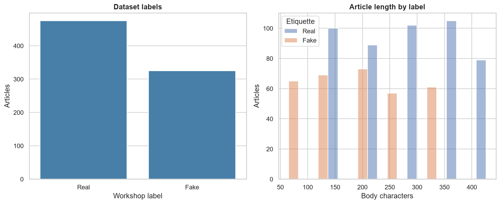
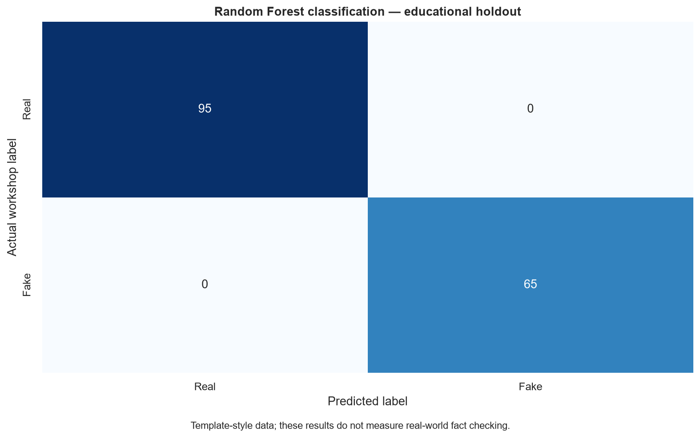
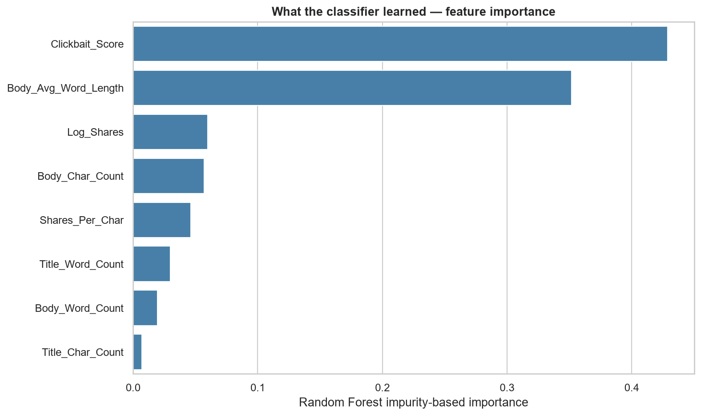

# Fake News Classification & Analysis

I built this project entirely on my own for my participation in **GDG on Campus – ENSAK**.

It combines Python, data analysis, and machine learning to classify news articles as real or fake using a labeled dataset. The project also includes keyword analysis, text clustering, and an exploration of sharing activity.



## Tools

Python · pandas · NumPy · scikit-learn · Matplotlib · Seaborn

## What the project includes

- Data preparation, missing-text handling, and duplicate removal.
- Feature engineering from headlines, article lengths, and sharing counts.
- News classification with a Random Forest.
- Evaluation with accuracy, F1 score, and a confusion matrix.
- Feature-importance charts and keyword frequency analysis.
- Text clustering with TF-IDF and K-Means.
- An exploratory regression model for article sharing counts.

## Results

The main analysis uses an 80/20 train-test split with a fixed random seed. The charts below show the classification results and the features used by the model.





The dataset contains repeated text, including overlap between training and test data, so these results apply to this dataset. They do not measure accuracy on new, real-world news.

[Evaluation report](results/classification_report.txt) · [Detailed metrics](results/metrics.json) · [Notebook](notebooks/fake_news_analysis.ipynb)

## Run the project

The project was run with Python 3.11. From the repository folder:

```bash
python -m venv .venv
```

Activate the environment on Windows PowerShell:

```powershell
.\.venv\Scripts\Activate.ps1
```

Or on macOS / Linux:

```bash
source .venv/bin/activate
```

Install the dependencies and run the analysis:

```bash
python -m pip install -r requirements.txt
python src/analysis.py
```

The charts and reports are saved in `results/`. To run the filtered dataset separately:

```bash
python src/analysis.py --data data/fake_news_no_outliers.csv --output .local/filtered-results
```

The notebook can also be opened in VS Code using the environment's Python kernel.

## Files

| Folder | Contents |
| --- | --- |
| `data/` | The two CSV datasets and their column descriptions |
| `src/` | The main analysis script |
| `notebooks/` | The notebook with saved results and charts |
| `results/` | Charts, evaluation reports, and metrics |
| `originals/` | My original project scripts and notebook |
| `tests/` | Checks for feature construction and regression inputs |

To run the checks:

```bash
python -m unittest discover -s tests -v
```
